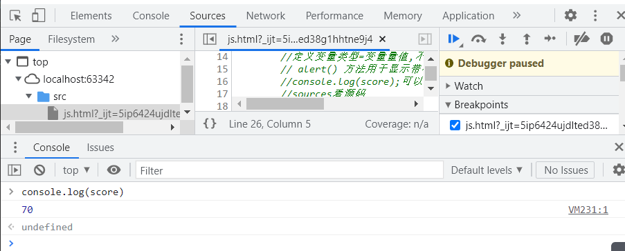

#   javaScript

##    

1. ```bash
      JavaScript的用途
   1. **HTML** 定义了网页的内容
   
   2. **CSS** 描述了网页的布局
   
   3. **JavaScript** 控制了网页的行为
   
      JavaScript 显示数据
   
      JavaScript 可以通过不同的方式来输出数据：
   
      - 使用 **window.alert()** 弹出警告框。
      - 使用 **document.write()** 方法将内容写到HTML 文档中。
      - 使用 **innerHTML** 写入到 HTML 元素。
      - 使用 **console.log()** 写入到浏览器的控制台
   ```

## 开始使用

创建按钮,并跳转到对应函数

```javascript
<button onclick="myFunction()">试一试</button>
```


```javascript
<!DOCTYPE html>
<html lang="en">
<head>
    <meta charset="UTF-8">
    <title>Title</title>
     <!--注释-->
    <!--代码位置-->
    <!--script成对出现-->
    <!--HTML 中的脚本必须位于 <script> 与 </script> 标签之间
     脚本可被放置在 HTML 页面的 <body> 和 <head> 部分中。-->

    <!--代码位置-->
    <script>
        //定义变量类型=变量量值,不可转变,严格区分大小写
        // alert() 方法用于显示带有一条指定消息和一个 OK 按钮的警告框。
        //console.log(score);可以在浏览器控制台查看变量，设置断点等等
        //sources看源码
       var score =70;
       if (score>60&&score<70){
           alert("60-70之间")
       }else if (score>70&&score<80){
           alert("70-80之间")
       }else{
           alert("other")
       }
    </script>
</head>
<body>
<!--代码位置-->
</body>
</html>
```



## 变量使用

定义变量

```
var xx="字符串";
var mm=18;
```

```javascript
<script>
    //定义一个unfine变量
    var xx;
    xx="对xx进行赋值"
    //可以声明多个变量并声明，用逗号隔开
    //可以使用运算符号，字符使用可以相联
    var m="xiaoming"+""+"小花";
    //xiaoming 小花
    //如果把要给数值放入引号中，其余数值会被视作字符串并被级联。
    var a="9"+8+7;
    //输出987
</script>
```


## let和const使用

```javascript

var  x = 10;
// Here x is 10
{  
  var x = 2;
  // Here x is 2
}
// Here x is 2
```

```javascript
var  x = 10;
// Here x is 10
{  
  let x = 2;
  // Here x is 2
}
// Here x is 10
```

```javascript
var x = 10;
    // 此处，x 为 10
    {
        const x = 6;
        // 此处，x 为 6
    }
    // 此处，x 为 10
    //const需要声明并赋值，不可以单独声明
    //const可修改数组元素和添加
    const o=["小白","小红",8,9];
    o[0]="小绿"
    o.push("小黄")
```


## 字符串string

```javascript
<script>
    //java script 6版本以上可以用   'use strict'检查模式
    //
    'use strict';
    var msg = 'hello wrold';
    //转义字符串   \  和其他语言差不多
    console.log("\u4e2d")
    console.log("\a")
    //输出字符长度
    console.log(msg.length)
    //可以输出长字符串  使用反引号··
    var kk = `hhdajdja
   djadla
    ld;ald;a`
    //输出大小写
    var xx="xx"
    console.log(xx.toUpperCase())
    console.log(xx.toLowerCase())
    //获取下标位置的
    console.log(msg.indexOf("e"))
</script>
```


*模板字面量*提供了一种将变量和表达式插入字符串的简单方法。

${...},${...}

```
 let firstName="小明";
        let lastName="小华";
        let text = `Welcome ${firstName}, ${lastName}!`;
        //Welcome 小明, 小华!
```

## 运算

运算和其他语言差不多

```javascript
    var x = 5;
    var z = Math.pow(x,2);//相当于5*5 幂运算
    var z = x ** 2;  //相当于5*5=25
```


## 数组array

```javascript
<script>
    //array数组 可以存储任何数据类型,可以根据下标赋值，或者length增加长度 ，如果长度赋值元素过小会丢失arr内部元素
    var arr =[1,2,3,"myworld"]
    console.log(arr)
    console.log(arr.length)
    console.log(arr.length=9)
    console.log(arr)
    console.log(arr.length=2)
</script>
```


以上用浏览器控制台方式查看元素内容

可以使用 document.getElementById(*id*) 方法。

请使用 "id" 属性来标识 HTML 元素，并 innerHTML 来获取或插入元素内容：

```javascript
<!DOCTYPE html>
<html lang="en">
<head>
    <meta charset="UTF-8">
    <title>Title</title>
</head>
<p id="demo"></p>
<p id="demo1"></p>
<script>
    var x = 7;
    var y = 8;
    var z = x * y;

    document.getElementById("demo").innerHTML = z;

</script>
<script>
    var msg ="hello";
    document.getElementById("demo1").innerHTML=msg;
</script>
<body>

</body>
</html>
```

网页输出内容为 56 hello

## 数组的方法

1.toString(),逗号形式分割字符串

2.join()将所有数组中元素结合成字符串，还可以join("*")你想用的分隔符的方式隔开

```javascript
console.log(arr.join("*"));
//1*2*3*myworld*****
```

3.增删元素

```javascript
    var f =["你xx","熊哈哈"];   
   //增加和删除数组元素
    f.pop();
    //['你xx']
    f.push("我骑着扫帚飞")
    //['你xx', '我骑着扫帚飞']
    f.pop();
    //['你xx']
    f.push("我骑着扫帚飞")
    //['你xx', '我骑着扫帚飞']
    //改变数组元素
    f[0]="熊哈哈"
    //['熊哈哈', '我骑着扫帚飞']
    //返回数组长度
    f.push("你xx");
    //(3)['熊哈哈', '我骑着扫帚飞', '你xx']
    //删除首个元素，推下索引
    f.shift();
    //['我骑着扫帚飞', '你xx']
    //开头增加元素
     f.unshift("一周又开始了");
    //['一周又开始了', '我骑着扫帚飞', '你xx']
   //删除指定元素,使用 delete 会在数组留下未定义的空洞
    delete f[0];
   //(3)[empty, '我骑着扫帚飞', '你xx']
  //拼接数组第一个参数（2）定义了应添加新元素的位置（拼接）。第二个参数（0）定义应删除多少元素。
    f.splice(1,0,"这一周快结束吧")

```

## 数组排列

```javascript
<button onclick="myFuncion()">点击</button>
<script>
sort()
//正序排列
var m =[1,3,2,4];
m.sort();
//(4) [1, 2, 3, 4]
reverser()
//反转
console.log(m);
//(4) [4, 3, 2, 1]
var points=[100,25,87,7];
    function myFunction() {
        points.sort(function(a, b){return a - b});
    }
   // (4)[7, 25, 87, 100]
</script>
//对数组使用 Math.min()/max()
//您可以使用 Math.min.apply 来查找数组中的最低值：和最高值

```

注意

默认地，sort() 函数按照*字符串*顺序对值进行排序。

该函数很适合字符串（"Apple" 会排在 "Banana" 之前）。

不过，如果数字按照字符串来排序，则 "25" 大于 "100"，因为 "2" 大于 "1"。

正因如此，sort() 方法在对数值排序时会产生不正确的结果。

我们通过一个*比值函数*来修正此问题：

```javascript
var points=[100,25,87,7];
    function myFunction() {
        points.sort(function(a, b){return a - b});
    }
```


## 对象

类似go 中map， py中的Dictionary

```javascript
 <script>
        var person={
            name : "小明",
            age : 18,
            project : "数学"
        };
        document.getElementById("demo").innerHTML=
            person.age+"岁学"+person.project;
    </script>
    <p id="demo1"></p>
    <script>
        var person = {
            firstName : "John",
            lastName  : "Doe",
            age       : 50,
            eyeColor  : "blue"
        };
        document.getElementById("demo1").innerHTML =
            person.firstName + " 现在 " + person.age + " 岁。";
    </script>

```

输出为

18岁学数学

John现在50岁

## switch

```javascript
 <button onclick="myFunction()">点击</button>
<p id="demo"></p>
<body>
<script>
    function myFunction()
    {
        var x;
        var d=new Date().getDay();
        switch (d)
        {
            case 6:x="今天是星期六";
                break;
            case 0:x="今天是星期日";
                break;
            default:
                x="期待周末";
        }
        document.getElementById("demo").innerHTML=x;
    }
</script>

```

以上都不是输出为--期待周末